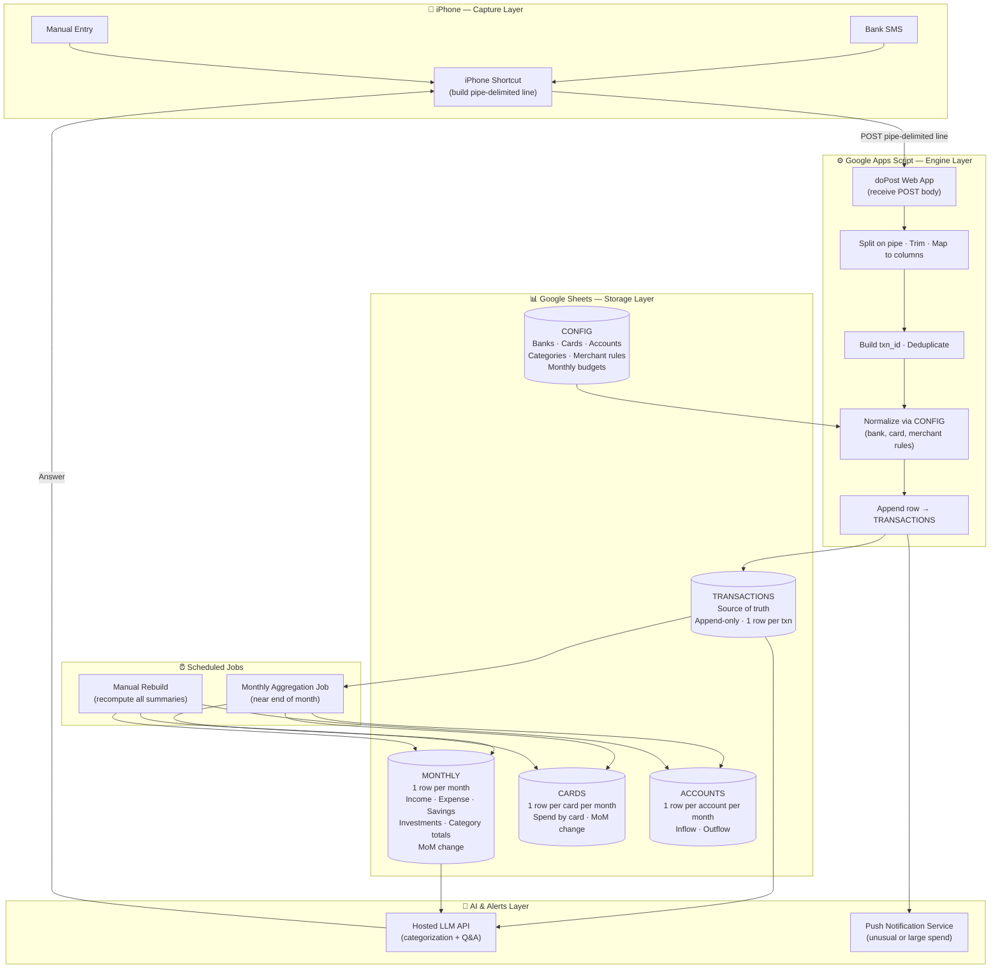

# Personal Finance Intelligence System

A free and automated system that records every income and expense transaction from an iPhone, stores it in Google Sheets, and produces monthly summaries and rich analytics that show exactly where money comes from and where it goes. The design targets Indian banking, where most spending happens through UPI, credit cards, debit cards, and auto debits, and where bank SMS alerts are the main signal for every transaction.

---

## Goal

Capture each transaction with very little effort, keep one clean history of all money movement, and compute monthly and category-level analytics that answer:

- Where money is actually going
- Which bank account and which credit card it flows through
- How spending changes from month to month

---

## Architecture Overview

Each transaction is sent as a single pipe-delimited line from an iPhone Shortcut to a Google Apps Script web app. The Shortcut can build the line from a parsed bank SMS or from a quick manual entry. Apps Script splits the line, normalizes it, and appends it as one row in a transactions sheet. A monthly job then aggregates all transactions into a monthly summary, a per-card summary, and a per-account summary, and computes month-over-month changes. Questions about spending are answered by reading these summaries, and later by a language model that reasons over them.

---

## Architecture Diagram



---

## Components

| Component | Role |
|---|---|
| iPhone Shortcut | Captures or pastes a transaction and sends it to the web app |
| Google Apps Script Web App | Engine that ingests, normalizes, and aggregates data |
| Google Sheets | Structured storage with tabs for raw data, summaries, and config |
| Hosted LLM API | Categorization assistance and natural language Q&A |
| Push Notification Service | Alerts on large or unusual spends (optional) |

---

## Storage Layout

The Google Sheet separates raw records from computed summaries.

### TRANSACTIONS
- Source of truth
- Append-only, one row per transaction
- Never edited by hand

### MONTHLY
- One row per month
- Totals for income, expense, savings, investments, and every spending category
- Month-over-month changes

### CARDS
- One row per credit card per month
- Spending on each card can be compared across months

### ACCOUNTS
- One row per bank account per month
- Inflow and outflow per account is clear

### CONFIG
- Known banks, accounts, cards, categories, merchant rules, and monthly budgets
- Keeping these in a tab lets behavior change without editing code

---

## The Most Important Rule

Accurate analytics depend on not double-counting money that only moves between your own places. Three flows must be tagged and kept out of the spending totals.

1. **Transfer** — A transfer between your own accounts is not income and not expense.
2. **Card Payment** — A credit card bill payment from a bank account is not a new expense, because the real spends were already recorded when each purchase happened on the card.
3. **Refund** — A refund or reversal reduces the original expense rather than adding income.

Every transaction therefore carries a `type` that marks whether it is `income`, `expense`, `transfer`, `card_payment`, `investment`, or `refund`, and **only true income and true expense feed the spending and savings analytics.**

---

## Transaction Data Model

Each transaction is one flat row in TRANSACTIONS.

| Field | Description |
|---|---|
| `txn_id` | Unique ID used to avoid storing the same transaction twice |
| `datetime` | Date and time of the transaction |
| `amount` | Value as a positive number |
| `direction` | `debit` or `credit` — money out or money in |
| `type` | One of `income`, `expense`, `transfer`, `card_payment`, `investment`, or `refund` |
| `instrument` | How money moved: UPI, Credit Card, Debit Card, Net Banking, NEFT/IMPS, Auto Debit/Mandate, Wallet, or Cash |
| `bank` | Bank involved: HDFC, ICICI, SBI, Axis, Kotak, etc. |
| `account` | Nickname or last four digits of the account used |
| `account_type` | Savings, Current, Credit Card, Wallet, or Cash |
| `card_name` | Specific credit card used (e.g., HDFC Millennia, Axis Flipkart); empty when no card is involved |
| `merchant` | Payee or merchant name |
| `category` | Main spending or income category |
| `subcategory` | Optional finer label |
| `counterparty` | UPI ID or account on the other side, when available |
| `ref_no` | UPI reference or bank reference number; useful for deduplication |
| `balance_after` | Account balance after the transaction when the SMS provides it |
| `is_recurring` | Flag for known recurring payments such as rent, EMI, or subscriptions |
| `needs_review` | Flag set when the category is uncertain and should be confirmed later |
| `user_notes` | Short free-text note |
| `original_message` | Raw bank SMS or source text, kept for reference and later reparsing |

---

## Indian Context

### Instruments Commonly Seen

UPI (Google Pay, PhonePe, Paytm), credit cards, debit cards, net banking, NEFT / IMPS / RTGS transfers, auto-debit mandates for SIPs and bills, prepaid wallets, FASTag for tolls, and cash.

### Income Categories

- Salary
- Freelance or business income
- Interest from savings and fixed deposits
- Dividends
- Rental income
- Cashback and rewards
- Refunds and reversals
- Reimbursements from employer
- Capital gains from stocks or mutual funds
- Maturity proceeds from deposits or insurance
- Gifts received
- Other income

### Expense Categories

| Category | Subcategories / Examples |
|---|---|
| **Housing and Utilities** | Rent, home loan EMI, society maintenance, electricity, water, piped/cylinder gas, property tax |
| **Food and Dining** | Groceries, restaurants, food delivery (Swiggy, Zomato), tea/coffee |
| **Shopping** | Clothing, electronics, online orders (Amazon, Flipkart, Myntra) |
| **Bills and Subscriptions** | Mobile postpaid/recharge, broadband, DTH, streaming (Netflix, Prime, Hotstar, Spotify) |
| **Transportation** | Fuel, Ola/Uber, autos, metro, bus, train (IRCTC), flights, parking, FASTag, vehicle service |
| **Healthcare** | Pharmacy, doctor consultations, diagnostics, hospital bills, fitness/gym |
| **Investments** | Mutual fund SIPs, stocks, PPF, NPS, FDs/RDs, gold/SGBs |
| **Insurance** | Term/life premiums, health, vehicle insurance |
| **EMI and Loans** | Personal, home, car, education loans; BNPL dues |
| **Education** | Tuition, courses, books, coaching |
| **Personal Care** | Salon, grooming, cosmetics |
| **Entertainment** | Movies, events, games, hobbies |
| **Travel** | Hotels, holiday trips |
| **Family and Dependents** | Money sent to parents or family |
| **Gifts and Donations** | Gifts, charity, religious giving |
| **Taxes and Fees** | Income tax, GST, TDS, bank charges, late fees, ATM fees |
| **Cash Withdrawal** | ATM withdrawals where actual spend is unknown until later categorized |
| **Miscellaneous** | Anything not yet classified |

---

## Pipe-Delimited Input Format

A transaction is sent as one line with fields in a fixed order separated by a vertical bar (`|`). Empty fields are allowed and are left blank between bars.

**Field order:**
```
datetime | amount | direction | type | instrument | bank | account | account_type | card_name | merchant | category | user_notes | original_message
```

### Examples

**Credit card expense (Swiggy)**
```
2026-06-25 13:40|850|debit|expense|Credit Card|HDFC|Millennia|Credit Card|HDFC Millennia|Swiggy|Food and Dining|team lunch|Spent Rs 850 on HDFC Millennia card at SWIGGY
```

**UPI expense from savings account (DMart)**
```
2026-06-25 19:10|1200|debit|expense|UPI|ICICI|xx4321|Savings||DMart|Shopping|monthly groceries|Rs 1200 debited via UPI to DMART
```

**Salary credit**
```
2026-06-01 10:00|90000|credit|income|Net Banking|HDFC|xx9988|Savings||Employer|Salary|june salary|Salary credited Rs 90000
```

**Credit card bill payment (must NOT count as a new expense)**
```
2026-06-05 11:00|24500|debit|card_payment|Net Banking|HDFC|xx9988|Savings|HDFC Millennia|HDFC Card|Credit Card Payment|june card bill|Payment of Rs 24500 to HDFC card
```

---

## Implementation Logic

### 1. Capture on the Phone

- Build a Shortcut that takes either a pasted bank SMS or a few quick manual inputs.
- When given an SMS, extract amount, direction, bank, instrument, and merchant from the text.
- Ask for or infer the type, category, and the card or account used.
- Assemble the fields into one pipe-delimited line in the fixed order.
- Send the line as the body of a POST request to the Apps Script web app.

### 2. Ingest into TRANSACTIONS

- In `doPost`, read the body and split it on the vertical bar into fields.
- Trim each field and map it to its column name.
- Build a `txn_id` from datetime, amount, and ref_no so repeated sends are detected.
- Skip the row if the `txn_id` already exists; otherwise append it.
- Set `needs_review` when the category is missing so it can be fixed later.

### 3. Normalize and Categorize

- Look up the merchant in CONFIG rules to assign a category automatically when possible.
- Standardize bank, account, and card names against the CONFIG lists.
- Mark known recurring payees such as rent, EMI, and subscriptions as recurring.
- Leave `needs_review` set for anything the rules cannot classify.

### 4. Build the Monthly Summary

- Read all transactions for the target month.
- Sum income from rows of type `income`, and expense from rows of type `expense` only.
- Exclude `transfer`, `card_payment`, and `investment` rows from income and expense totals.
- Compute savings as income minus expense, and the savings rate as savings divided by income.
- Sum investment rows separately into an investments total.
- Sum expense by category into one column per category.
- Write one row for the month into MONTHLY and compute the change from the previous month.

### 5. Build the Card and Account Summaries

- Group expense rows by `card_name` and by month, and write totals into CARDS.
- For each card, compute the change versus the previous month so rising card spend is visible.
- Group inflow and outflow by account and by month, and write totals into ACCOUNTS.

### 6. Alert on Unusual Spends

- When a single expense is far above the usual range, send a push notification.
- When a category in the current month is well above its recent average, flag it.

### 7. Schedule Everything

- Run ingestion on each incoming request through `doPost`.
- Run a monthly job near the end of each month.
- Allow a manual rebuild that recomputes all summaries from TRANSACTIONS.

---

## Implementation Examples

### Apps Script — Receive Pipe-Delimited Line and Append Row

```javascript
const COLS = ["datetime","amount","direction","type","instrument","bank",
  "account","account_type","card_name","merchant","category","user_notes",
  "original_message"];

function doPost(e) {
  const parts = e.postData.contents.split("|").map(s => s.trim());
  const row = {};
  COLS.forEach((c, i) => row[c] = parts[i] ?? "");
  row.txn_id = makeId(row);
  const sheet = SpreadsheetApp.getActive().getSheetByName("TRANSACTIONS");
  if (existsId(sheet, row.txn_id)) return reply({ ok: true, duplicate: true });
  sheet.appendRow(COLS.map(c => row[c]).concat([row.txn_id]));
  return reply({ ok: true });
}

function makeId(r) {
  return [r.datetime, r.amount, r.merchant].join("_");
}

function reply(obj) {
  return ContentService.createTextOutput(JSON.stringify(obj))
    .setMimeType(ContentService.MimeType.JSON);
}
```

### Monthly Aggregation Logic

```javascript
function buildMonthly(month) {
  const rows = getMonthRows(month);                 // all txns in the month
  let income = 0, expense = 0, invest = 0;
  const byCategory = {};
  rows.forEach(r => {
    const amt = Number(r.amount);
    if (r.type === "income") income += amt;
    else if (r.type === "expense") {
      expense += amt;
      byCategory[r.category] = (byCategory[r.category] || 0) + amt;
    } else if (r.type === "investment") invest += amt;
    // transfer and card_payment are ignored on purpose
  });
  const savings = income - expense;
  writeMonthlyRow(month, income, expense, savings, invest, byCategory);
}
```

---

## Analytics That Matter

Focus on the few numbers that change financial decisions and avoid totals that only restate the obvious.

| Metric | What it reveals |
|---|---|
| **Savings rate** | How much of income is kept after real expenses |
| **Category share** | Which categories take the largest part of spending |
| **Month-over-month change per category** | What is quietly rising |
| **Per-card spend and its trend** | Which credit card is being used the most and whether it is growing |
| **Recurring vs one-time spend** | Separates fixed commitments from discretionary choices |
| **Top merchants** | Often reveals a small number of places taking a large share |

---

## Supported Queries

### Status Questions

- How much did I spend this month and how much did I earn?
- What is my savings rate this month?
- How much have I spent so far today and this week?
- How much is sitting across my accounts right now?
- How much of my credit card limit have I used this cycle?

### Category Questions

- Where did most of my money go this month?
- How much did I spend on food and dining this month?
- What share of my spending is fixed bills versus discretionary?
- How much did I spend on groceries compared to eating out?
- How much went to investments this month?

### Card and Account Questions

- Which credit card did I spend the most on this month?
- Which card has higher spending than last month?
- How much did each bank account spend and receive this month?
- Which account is my highest outflow account?
- How much did I pay in total credit card bills this month?

### Trend and Comparison Questions

- How does this month compare with last month overall?
- Which category increased the most compared to last month?
- Is my food spending trending up over the last three months?
- How has my savings rate changed over the last six months?
- Are my subscription bills slowly increasing?

### Merchant and Behavior Questions

- Which merchants did I spend the most at this month?
- How much did I spend on Swiggy and Zomato together?
- How often do I withdraw cash and how much?
- What are my recurring payments and how much do they total?
- Which one-time large purchases happened this month?

### Planning and Saving Questions

- Which category should I cut to improve my savings rate?
- Am I on track against my monthly budget for each category?
- How much could I save by reducing food delivery?
- Based on recent months, what is a realistic savings target for next month?
- Which subscriptions look unused and worth reviewing?

### Tax and Review Questions

- How much did I pay in bank charges and fees this year?
- How much did I invest this year across all instruments?
- How much reimbursable spending is still pending?
- Which transactions are still unreviewed and need a category?

---

## Future AI and Scalability

These additions make the system smarter while keeping the same free and automated base.

### Automatic SMS Parsing
- Send the raw bank SMS to a language model to extract amount, direction, bank, merchant, and instrument.
- Let the model propose the type and category, and only ask the user when confidence is low.

### Smart Categorization That Learns
- Store merchant-to-category mappings in CONFIG and grow them from past confirmations.
- When a new merchant appears, let the model suggest a category and remember the choice.

### Anomaly and Fraud Alerts
- Learn the normal range per category and per merchant.
- Flag a charge that is unusually large, a duplicate charge, or a new merchant on a card for quick review.

### Forecasting and Cash Flow
- Use recurring payments and recent trends to project end-of-month spending early.
- Warn when projected expense will push the savings rate below a target.

### Agent with Tools
- Expose actions such as get a month, get a category trend, get card spend, and set a budget.
- Let the model plan and call these actions to answer free-form money questions.

### Tiered Summaries for Years of Data
- Keep monthly summaries as the base, and roll them up into quarterly and yearly views.
- Answer long-range questions from the rolled-up views so reports stay fast.

---

## Build Order

```mermaid
flowchart LR
    S1["1️⃣ Create TRANSACTIONS tab\n+ doPost web app\n(confirm one line stores)"]
    S2["2️⃣ Build iPhone Shortcut\n(manual first,\nthen from SMS)"]
    S3["3️⃣ Add type rule\n(exclude transfers,\ncard payments, refunds)"]
    S4["4️⃣ Monthly job → MONTHLY\n(income, expense, savings,\ninvestments, categories)"]
    S5["5️⃣ CARDS + ACCOUNTS\nsummaries with MoM changes"]
    S6["6️⃣ Unusual spend\nnotifications"]
    S7["7️⃣ Question branch + AI\ncategorization + forecasting"]

    S1 --> S2 --> S3 --> S4 --> S5 --> S6 --> S7

    style S1 fill:#2d6a4f,color:#fff
    style S2 fill:#2d6a4f,color:#fff
    style S3 fill:#2d6a4f,color:#fff
    style S4 fill:#2d6a4f,color:#fff
    style S5 fill:#74c69d,color:#000
    style S6 fill:#74c69d,color:#000
    style S7 fill:#b7e4c7,color:#000
```



> **Make steps 1–4 solid before adding AI.** Clean and correctly typed transactions are most of the value.

---

## Constraints

- The pipeline runs automatically and needs no manual step beyond sending each transaction.
- The system uses free-tier services so the running cost stays near zero.
- The iPhone is the main capture device, with bank SMS as the primary source.
- All amounts are tracked in Indian Rupees (₹).
